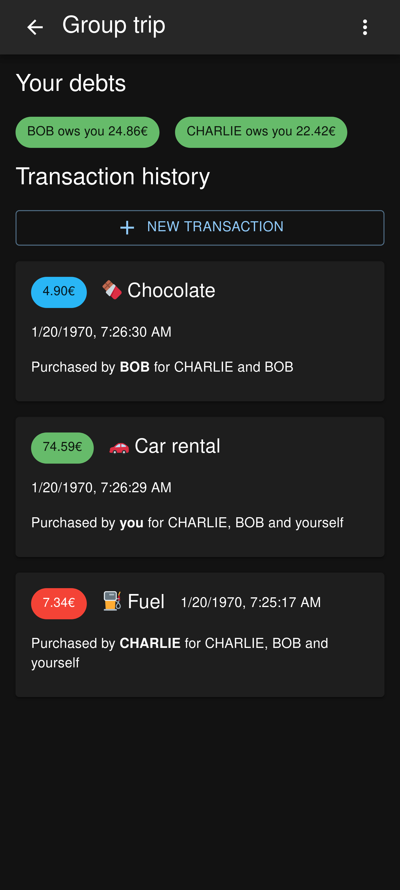
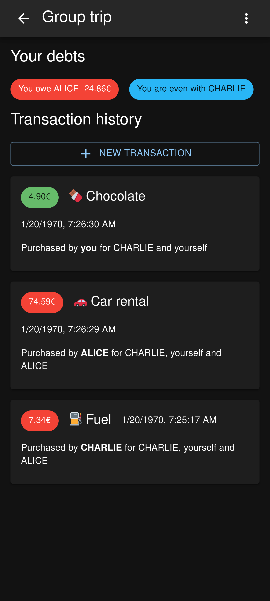

<h1 align="center">
    money-balancer
</h1>

<p align="center">
  <a href="https://github.com/dorianim/money-balancer/actions/workflows/release.yml">
    
  </a>
  <a href="https://rust-reportcard.xuri.me/badge/github.com/dorianim/money-balancer">
    
  </a>
</p>

Have you ever been on a group trip and lost track of who paid for what and who owes money to whom? If so, money balancer is the perfect tool for you! It helps you to keep track of who paid for what and calculates your balance with all of your friends. A demo is available [here](https://money-balancer.gentlemeadow-7beeb17b.northeurope.azurecontainerapps.io/#/login) but it may be reset at any time.

# Screenshots

<table align="center">
  <tr>
    <td align="center">
      <a href=".github/media/screenshot-1.png">
        
      </a>
    </td>
    <td align="center">
      <a href=".github/media/screenshot-2.png">
        
      </a>
    </td>
  </tr>
</table>

# Usage

Using `docker-compose`:

```yaml
version: "3"
services:
  money-balancer:
    image: ghcr.io/dorianim/money-balancer
    restart: unless-stopped
    ports:
      - 8000:8000
    volumes:
      - ./data:/data
    environment:
      - MONEYBALANCER_JWT_SECRET=some_super_secret_secret
```

Using `docker`:

```bash
docker run -p8000:8000 -e MONEYBALANCER_JWT_SECRET=some_super_secret_secret -v $(pwd)/data:/data ghcr.io/dorianim/money-balancer
```

You can then access money-balancer on [`http://localhost:8000`](http://localhost:8000). The API documentation can be found at [`http://localhost:8000/api/v1`](http://localhost:8000/api/v1).

# Config options

- `MONEYBALANCER_JWT_SECRET`: a random value for the JWT signature

### Authentication

##### Local

- `MONEYBALANCER_AUTH_LOCAL_ENABLED`: enable local username/password authentication

##### Proxy

Proxy authentication can be used with services like [Authelia](https://www.authelia.com/) and [Authentik](https://goauthentik.io)

- `MONEYBALANCER_AUTH_PROXY_ENABLED`: enable proxy authentication
- `MONEYBALANCER_AUTH_PROXY_HEADERS_USERNAME`: header containing the username (e.g. `X-authentik-username`)
- `MONEYBALANCER_AUTH_PROXY_HEADERS_NICKNAME`: header containing the nickname (e.g. `X-authentik-name`)

If you want to use another sign on method, you may only protect the route `/api/v1/auth/proxy`.

For example in [Authentik](https://goauthentik.io), you may use this as the unauthenticated paths:

```
/
/api/v1/[^/]*/(?!proxy).*
```

# How debts are split up:

- amount / debtors
- the potential rest is assigned to people who have to overpay
- who has to overpay is determined by how often they have overpaid in the past in this specific group

# Development

You need `cargo` and `yarn` installed on your system. You can build everything using

```
cargo build
```

This will create a static binary in `target/debug/money-balancer` which you can run.
